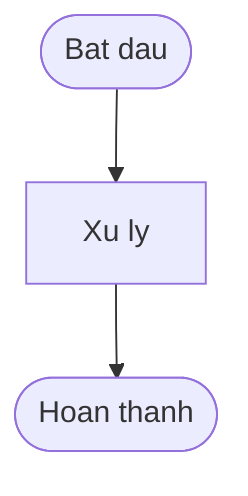
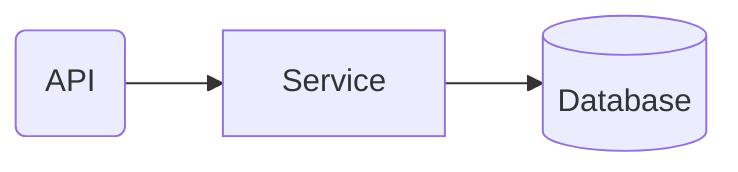

<objective>
Tao 2 Markdown deliverables nen tang: (1) mermaid-rules.md — nguon su that duy nhat cho quy tac tham my Mermaid, va (2) management-report.md — template bao cao quan ly 7 sections voi Mermaid placeholders.

Purpose: Cung cap spec de validator (Plan 02) implement va template de Phase 22 fill noi dung.
Output: references/mermaid-rules.md, templates/management-report.md
</objective>

<execution_context>
@$HOME/.claude/get-shit-done/workflows/execute-plan.md
@$HOME/.claude/get-shit-done/templates/summary.md
</execution_context>

<context>
@.planning/PROJECT.md
@.planning/ROADMAP.md
@.planning/STATE.md
@.planning/phases/21-mermaid-foundation/21-CONTEXT.md
@.planning/phases/21-mermaid-foundation/21-RESEARCH.md
</context>

<tasks>

<task type="auto">
  <name>Task 1: Tao references/mermaid-rules.md — Mermaid aesthetic rules spec (MERM-01)</name>
  <files>references/mermaid-rules.md</files>
  <read_first>
    - references/plan-checker.md (pattern: rules spec format, header structure, severity table)
    - .planning/phases/21-mermaid-foundation/21-CONTEXT.md (decisions D-01 through D-10)
    - .planning/phases/21-mermaid-foundation/21-RESEARCH.md (Mermaid syntax reference, reserved keywords, pitfalls)
  </read_first>
  <action>
Tao file `references/mermaid-rules.md` theo DUNG pattern cua `references/plan-checker.md` (header voi "Nguon su that duy nhat", doc boi ai, sections co so thu tu).

File PHAI co cac sections sau:

**Header:**
```
# Mermaid Rules
> Nguon su that duy nhat cho mermaid-validator.js
> Doc boi: mermaid-validator.js (implement), test (validate), AI skills (generate diagrams)
```

**Section 1: Color Palette (per D-01)**
Bang 5 mau voi ten, hex code, stroke color, text color:
| Ten | Fill | Stroke | Text |
|-----|------|--------|------|
| primary | #2563EB | #1e40af | #fff |
| secondary | #64748B | #475569 | #fff |
| accent | #10B981 | #059669 | #fff |
| warning | #F59E0B | #d97706 | #000 |
| error | #DC2626 | #b91c1c | #fff |

Kem classDef syntax:
```
classDef primary fill:#2563EB,stroke:#1e40af,color:#fff
classDef secondary fill:#64748B,stroke:#475569,color:#fff
classDef accent fill:#10B981,stroke:#059669,color:#fff
classDef warning fill:#F59E0B,stroke:#d97706,color:#000
classDef error fill:#DC2626,stroke:#b91c1c,color:#fff
```

**Section 2: Node Shapes (per D-02)**
Bang 6 roles voi shape, Mermaid syntax, vi du tieng Viet:
| Role | Shape | Syntax | VD |
|------|-------|--------|-----|
| Service | Rectangle | `A["Label"]` | `svc["Xu ly don hang"]` |
| Database | Cylinder | `A[("Label")]` | `db[("PostgreSQL")]` |
| API | Rounded | `A("Label")` | `api("REST API")` |
| Decision | Diamond | `A{"Label"}` | `dec{"Hop le?"}` |
| Start/End | Stadium | `A(["Label"])` | `start(["Bat dau"])` |
| External | Subroutine | `A[["Label"]]` | `ext[["Payment Gateway"]]` |

**Section 3: Label Conventions (per D-03, D-09, D-10)**
- Node labels: 3-5 tu, tieng Viet (per D-09)
- Edge labels: 1-3 tu, tieng Viet
- LUON dung double quotes cho tat ca labels (per D-10)
- Khong viet tat kho hieu
- Vi du: `A["Xu ly don hang"] --> B["Thanh cong"]`

**Section 4: Max Nodes (per D-04)**
- Toi da 15 nodes per diagram
- Vuot qua 15 thi tach thanh subgraphs hoac diagrams rieng
- Validator se warn khi vuot 15 nodes

**Section 5: Direction Rules (Claude's Discretion)**
Bang 4 directions:
| Direction | Dung khi |
|-----------|---------|
| TD (Top-Down) | Business logic flows, process flows, hierarchies — **MAC DINH** |
| LR (Left-Right) | Architecture diagrams, timelines, pipelines |
| BT (Bottom-Top) | Hiem dung — hierarchy inversion |
| RL (Right-Left) | Hiem dung — reverse flows |

Dong dau tien PHAI la `flowchart [direction]` hoac `graph [direction]`.

**Section 6: Quoting Rules (per D-10 va Pitfalls)**
- TAT CA labels PHAI dung double quotes: `A["Label"]`
- Khong dung single quotes
- Khong de label khong co quotes
- Label KHONG duoc chua double quotes ben trong (nested quotes)
- Tieng Viet labels BAT BUOC phai quote vi dau tieng Viet co the break parser

**Section 7: Anti-Patterns (Claude's Discretion)**
Danh sach cac loi thuong gap:
1. Unquoted labels — break voi tieng Viet, reserved keywords
2. Reserved keywords lam node ID: end, graph, subgraph, click, call, default, style, classDef, class, linkStyle, _self, _blank, _parent, _top
3. Node ID bat dau bang 'o' hoac 'x' (don ky tu) — Mermaid interpret la edge decorator
4. AND/OR trong labels — dung "va"/"hoac" (tieng Viet) thay the
5. HTML tags `<...>` trong labels — bi interpret la HTML
6. Unclosed quotes — phai balanced per line
7. Thieu direction declaration o dong dau
8. Vuot 15 nodes khong tach subgraph

**Section 8: Arrow Types**
Bang arrow syntax:
| Arrow | Syntax | Meaning |
|-------|--------|---------|
| Solid | `-->` | Normal flow |
| Solid with text | `-->\|text\|` hoac `-- text -->` | Labeled flow |
| Dotted | `-.->` | Optional/async |
| Thick | `==>` | Critical path |
  </action>
  <verify>
    <automated>grep -c "^## " references/mermaid-rules.md | grep -E "^[8-9]$|^[1-9][0-9]$" && grep "#2563EB" references/mermaid-rules.md && grep "cylinder" references/mermaid-rules.md && grep "double quotes" references/mermaid-rules.md && grep "15 nodes" references/mermaid-rules.md && grep "Anti-Patterns" references/mermaid-rules.md && echo "PASS"</automated>
  </verify>
  <acceptance_criteria>
    - references/mermaid-rules.md exists va bat dau voi `# Mermaid Rules`
    - File co >= 8 sections (## headings): Color Palette, Node Shapes, Label Conventions, Max Nodes, Direction Rules, Quoting Rules, Anti-Patterns, Arrow Types
    - Section Color Palette chua 5 hex codes: #2563EB, #64748B, #10B981, #F59E0B, #DC2626
    - Section Color Palette chua classDef syntax cho 5 mau
    - Section Node Shapes chua 6 roles: Service, Database, API, Decision, Start/End, External
    - Section Node Shapes chua cylinder (Database shape)
    - Section Labels chua "double quotes" va "3-5 tu"
    - Section Max Nodes chua "15"
    - Section Direction co TD, LR, BT, RL
    - Section Quoting chua "double quotes" va "tieng Viet"
    - Section Anti-Patterns liet ke >= 7 anti-patterns bao gom: reserved keywords, unquoted labels, AND/OR
    - Section Arrow Types co -->, -.->, ==>
    - Header co dong "Nguon su that duy nhat cho mermaid-validator.js"
  </acceptance_criteria>
  <done>File references/mermaid-rules.md ton tai voi day du 8 sections covering color palette, node shapes, labels, max nodes, direction, quoting, anti-patterns, va arrow types. Content dung theo cac decisions D-01 den D-10.</done>
</task>

<task type="auto">
  <name>Task 2: Tao templates/management-report.md — Template bao cao quan ly 7 sections (REPT-01)</name>
  <files>templates/management-report.md</files>
  <read_first>
    - templates/current-milestone.md (pattern: template file format trong du an)
    - .planning/phases/21-mermaid-foundation/21-CONTEXT.md (D-07: 7 sections, D-08: tieng Viet)
    - .planning/phases/21-mermaid-foundation/21-RESEARCH.md (Management Report Template Structure section)
  </read_first>
  <action>
Tao file `templates/management-report.md` — template bao cao quan ly voi 7 sections (per D-07), toan bo tieng Viet (per D-08), co Mermaid code block placeholders.

File PHAI co noi dung sau:

```markdown
# Bao cao quan ly
> Milestone: {{milestone_name}} ({{version}})
> Ngay: {{date}}

## 1. Tom tat dieu hanh
<!-- AI fill: 3-5 bullet points tong quan milestone -->
<!-- Noi dung: Muc tieu milestone, ket qua dat duoc, thoi gian thuc hien -->

## 2. Tong quan Milestone
<!-- AI fill: bang tien do phases, so lieu thong ke -->
<!-- Format: bang Markdown voi cot Phase | Trang thai | Plans | Thoi gian -->

| Phase | Trang thai | Plans | Thoi gian |
|-------|-----------|-------|-----------|
| {{phase_name}} | {{status}} | {{plan_count}} | {{duration}} |

## 3. Luong nghiep vu (Business Logic Flow)
<!-- AI fill: Mermaid flowchart TD tu Truths va Key Links cua milestone -->
<!-- Moi Truth la mot node, lien ket theo dependency -->
<!-- Tuan thu mermaid-rules.md: quoted labels, max 15 nodes, Corporate Blue palette -->



## 4. Kien truc tong quan (Architecture Overview)
<!-- AI fill: Mermaid flowchart LR voi subgraphs tu Artifacts va CODE_REPORTs -->
<!-- Module boundaries ro rang, shapes theo Shape-by-Role (mermaid-rules.md) -->



## 5. Thanh tuu noi bat
<!-- AI fill: danh sach features, fixes, improvements quan trong nhat -->
<!-- Format: bullet list voi mo ta ngan gon tac dong kinh doanh -->

## 6. Chi so chat luong
<!-- AI fill: so lieu test coverage, so luong tests, code quality metrics -->
<!-- Format: bang hoac bullet list voi so lieu cu the -->

| Chi so | Gia tri |
|--------|---------|
| {{metric_name}} | {{metric_value}} |

## 7. Buoc tiep theo
<!-- AI fill: ke hoach milestone tiep theo, rui ro can theo doi -->
<!-- Format: bullet list voi timeline du kien -->
```

Luu y:
- Placeholders dung `{{variable_name}}` format de Phase 22 de nhan dien va replace
- Mermaid code blocks dung ``` mermaid (triple backtick + mermaid) — KHONG dung indent code block
- Comments `<!-- -->` mo ta cho AI biet can fill gi va format nhu the nao
- Toan bo tieng Viet — ca headings, comments, va placeholder labels
- Mermaid placeholder diagrams co comment `%% Placeholder — Phase 22 se generate`
  </action>
  <verify>
    <automated>grep -c "^## " templates/management-report.md | grep "^7$" && grep "Tom tat dieu hanh" templates/management-report.md && grep "Luong nghiep vu" templates/management-report.md && grep "Kien truc tong quan" templates/management-report.md && grep "flowchart TD" templates/management-report.md && grep "flowchart LR" templates/management-report.md && grep "{{milestone_name}}" templates/management-report.md && echo "PASS"</automated>
  </verify>
  <acceptance_criteria>
    - templates/management-report.md exists va bat dau voi `# Bao cao quan ly`
    - File co dung 7 sections (## headings): Tom tat dieu hanh, Tong quan Milestone, Luong nghiep vu, Kien truc tong quan, Thanh tuu noi bat, Chi so chat luong, Buoc tiep theo
    - Section 3 co Mermaid code block voi `flowchart TD`
    - Section 4 co Mermaid code block voi `flowchart LR`
    - File chua placeholder `{{milestone_name}}` va `{{version}}` va `{{date}}`
    - Mermaid blocks co comment `%% Placeholder`
    - Toan bo headings va comments bang tieng Viet — khong co heading tieng Anh
    - File co HTML comments `<!-- AI fill:` huong dan cho AI fill noi dung
  </acceptance_criteria>
  <done>File templates/management-report.md ton tai voi 7 sections tieng Viet, 2 Mermaid code block placeholders (flowchart TD va flowchart LR), template variables {{...}}, va AI fill instructions.</done>
</task>

</tasks>

<verification>
1. `ls references/mermaid-rules.md templates/management-report.md` — ca 2 file ton tai
2. `grep -c "^## " references/mermaid-rules.md` — >= 8 sections
3. `grep -c "^## " templates/management-report.md` — dung 7 sections
4. `grep "#2563EB" references/mermaid-rules.md` — Corporate Blue palette present
5. `grep "flowchart" templates/management-report.md` — Mermaid placeholders present
</verification>

<success_criteria>
- references/mermaid-rules.md ton tai voi >= 8 sections covering MERM-01 requirements
- templates/management-report.md ton tai voi dung 7 sections covering REPT-01 requirements
- Ca 2 files dung tieng Viet (per D-08, D-09)
- Mermaid rules co day du: colors (D-01), shapes (D-02), labels (D-03), max nodes (D-04), quoting (D-10)
</success_criteria>

<output>
After completion, create `.planning/phases/21-mermaid-foundation/21-01-SUMMARY.md`
</output>
