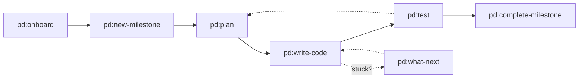

# PD Workflow Overview

The PD lifecycle in one diagram:

---

## When to Use Which Command?

| I want to...                         | Command                 |
|--------------------------------------|-------------------------|
| Start a new project                  | `pd:onboard`            |
| Define the next milestone            | `pd:new-milestone`      |
| Create plans and tasks for a phase   | `pd:plan`               |
| Execute tasks from TASKS.md          | `pd:write-code`         |
| Write and run tests                  | `pd:test`               |
| Finish a milestone                   | `pd:complete-milestone` |
| Figure out what to do next           | `pd:what-next`          |
| Check project status                 | `pd:status`             |

---

For command details, see [COMMAND_REFERENCE.md](COMMAND_REFERENCE.md).
