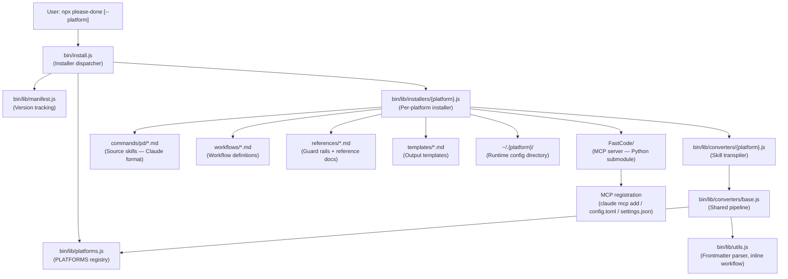

<!-- generated-by: gsd-doc-writer -->
# Architecture Overview — Please Done

## System Overview

Please Done is a cross-platform AI coding skills suite that delivers a structured development workflow (`/pd:*` commands) across 11 AI coding runtimes. The system is built around a single authoring model: skills are written once in Claude Code's Markdown-with-YAML-frontmatter format and then **transpiled at install time** into the native format each target platform requires. At its core, `npx please-done` runs the installer, which reads source skill files from `commands/pd/`, applies a platform-specific conversion pipeline, and writes the result into the target AI runtime's config directory. A FastCode MCP server (Python/Git submodule) is registered alongside the skills to provide codebase indexing and Q&A capabilities.

---

## Component Diagram



---

## Directory Structure

```
please-done/
├── bin/                        # Installer entry point and all Node.js tooling
│   ├── install.js              # CLI entry point — arg parsing, main() dispatcher
│   ├── sync-instructions.js    # Syncs AGENTS.md to all platform configs
│   ├── log-writer.js           # Session log writer utility
│   ├── plan-check.js           # Plan file validation utility
│   ├── route-query.js          # Query routing helper
│   ├── generate-pdf-report.js  # PDF report generator
│   ├── update-research-index.js# Research index updater
│   └── lib/
│       ├── platforms.js        # PLATFORMS registry and TOOL_MAP — all 11 runtimes
│       ├── utils.js            # Frontmatter parser, log helpers, workflow inliner
│       ├── manifest.js         # SHA256 manifest — tracks installed file hashes
│       ├── installer-utils.js  # Shared filesystem helpers (ensureDir, savePdconfig)
│       ├── prompt.js           # Interactive TTY prompts for runtime/location selection
│       ├── error-classifier.js # Error classification and user-facing hints
│       ├── installers/         # One installer module per platform
│       │   ├── claude.js       # Claude Code — symlinks + MCP via `claude mcp add`
│       │   ├── codex.js        # Codex CLI — skills/pd-*/SKILL.md + config.toml
│       │   ├── gemini.js       # Gemini CLI — commands/pd/*.toml + settings.json
│       │   ├── opencode.js     # OpenCode — command/pd-*.md (flat)
│       │   └── copilot.js      # GitHub Copilot — skills/pd-*/SKILL.md + instructions
│       └── converters/         # Skill transpilation pipeline
│           ├── base.js         # Shared 9-step conversion pipeline
│           ├── codex.js        # Claude → Codex (SKILL.md + XML adapter header)
│           ├── gemini.js       # Claude → Gemini TOML format
│           ├── opencode.js     # Claude → OpenCode flat Markdown
│           └── copilot.js      # Claude → Copilot SKILL.md + instructions
├── commands/pd/                # Source of truth — skills authored in Claude format
│   ├── *.md                    # 20 skill files (init, plan, write-code, etc.)
│   ├── rules/                  # Coding convention rules injected during /pd:init
│   └── agents/                 # Agent sub-command definitions
├── workflows/                  # Detailed workflow process definitions (XML structured)
│   └── *.md                    # One workflow per major skill (init, plan, write-code…)
├── templates/                  # Output file templates used by skills at runtime
│   └── *.md                    # PLAN.md, TASKS.md, CONTEXT.md, etc.
├── references/                 # Reference documents loaded conditionally by skills
│   ├── guard-*.md              # Guard rails (guard-fastcode, guard-valid-path…)
│   ├── security-checklist.md   # Security rules for auth/encryption tasks
│   ├── state-machine.md        # Milestone state machine definition
│   └── *.md                    # Other reference materials
├── FastCode/                   # Git submodule — Python MCP server
│   ├── mcp_server.py           # FastCode MCP entry point
│   ├── requirements.txt        # Python dependencies
│   └── .venv/                  # Python virtual environment (created at install time)
├── test/                       # Node.js native test runner test suite
│   ├── smoke/                  # Smoke tests — fast, no I/O
│   ├── integration/            # Integration tests
│   └── *.test.js               # Unit tests for lib modules
├── evals/                      # promptfoo-based LLM evaluation suite
├── docs/                       # Project documentation
├── scripts/                    # Maintenance scripts
├── env.example                 # Environment variable template
└── VERSION                     # Current version string (e.g., "12.3.0")
```

---

## Key Abstractions

| Abstraction | Location | Purpose |
|---|---|---|
| `PLATFORMS` | `bin/lib/platforms.js` | Registry of all 11 runtimes: config dir name, command prefix, skill format, MCP format |
| `TOOL_MAP` | `bin/lib/platforms.js` | Per-platform mapping of Claude tool names → native tool names (e.g., `Read` → `read_file` for Gemini) |
| `convertSkill()` (base) | `bin/lib/converters/base.js` | 9-step shared pipeline: parse frontmatter → inline workflow → convert command refs → path replace → fix pdconfig → map tool names → MCP convert → post-process → rebuild |
| `inlineWorkflow()` | `bin/lib/utils.js` | Reads `@workflows/X.md` references and inlines `<process>`, `<rules>`, `<required_reading>` blocks |
| `parseFrontmatter()` | `bin/lib/utils.js` | YAML frontmatter parser (no external YAML dependency) |
| `writeManifest()` | `bin/lib/manifest.js` | Records SHA256 hashes of all installed files for idempotency and local-patch preservation |
| `saveLocalPatches()` | `bin/lib/manifest.js` | Detects user-modified files before reinstall and backs them up to `pd-local-patches/` |
| `install()` / `uninstall()` | `bin/lib/installers/{platform}.js` | Platform-specific install/uninstall logic orchestrated by `bin/install.js` |

---

## Skill Installation Flow

The installer runs a 4-step outer flow for every selected runtime:

```
npx please-done --<runtime> [--global|--local]
        │
        ▼
1. BACKUP  — saveLocalPatches()
   Compare current installed files against pd-file-manifest.json
   Any user-modified file is backed up to pd-local-patches/ before overwrite

        │
        ▼
2. INSTALL — require('./lib/installers/{runtime}').install()
   Read source skills from commands/pd/*.md
   For each skill → run platform converter → write to target dir
   (Claude: symlinks; Codex/Copilot: skill dirs; Gemini: TOML; OpenCode: flat .md)
   Register FastCode MCP server (claude mcp add / config.toml / settings.json)
   Write .pdconfig with SKILLS_DIR + FASTCODE_DIR

        │
        ▼
3. MANIFEST — writeManifest()
   Record SHA256 hash of every installed file
   Enables idempotent re-installs and local-change detection

        │
        ▼
4. SYNC — node bin/sync-instructions.js
   Propagate AGENTS.md to all platform agent instruction files
```

### Idempotency

Before step 1, `checkUpToDate()` compares the requested version string against the version in `pd-file-manifest.json`. If they match, the installer exits early with no changes.

### Global vs Local

- **Global** (`--global`, default): installs into `~/.{platform}/` (e.g., `~/.claude/`)
- **Local** (`--local`): installs into `.{platform}/` inside the current working directory

The target directory is resolved by `getGlobalDir(runtime)` and `getLocalDir(runtime)` in `platforms.js`, which check the per-platform env var first (`CLAUDE_CONFIG_DIR`, `CODEX_HOME`, etc.) before falling back to defaults.

---

## Platform Registry and Runtime Support

The `PLATFORMS` object in `bin/lib/platforms.js` is the single source of truth for all platform behaviour. Every runtime entry specifies:

| Field | Purpose | Example (Claude) |
|---|---|---|
| `name` | Human-readable display name | `"Claude Code"` |
| `dirName` | Config directory name | `".claude"` |
| `commandPrefix` | Skill invocation prefix | `"/pd:"` |
| `commandSeparator` | Separator between namespace and name | `":"` |
| `envVar` | Override env variable | `"CLAUDE_CONFIG_DIR"` |
| `skillFormat` | How skills are laid out on disk | `"nested"` / `"flat"` / `"skill-dir"` |
| `frontmatterFormat` | Frontmatter format written to disk | `"yaml"` / `"toml"` |
| `toolMap` | Claude tool → platform tool name mapping | `{}` (Claude uses native names) |

### Supported Runtimes (11 total)

| Runtime flag | Platform | Skill prefix | Config dir | Skill format |
|---|---|---|---|---|
| `--claude` | Claude Code | `/pd:` | `~/.claude/` | `commands/pd/*.md` (symlinks) |
| `--codex` | Codex CLI | `$pd-` | `~/.codex/` | `skills/pd-*/SKILL.md` |
| `--gemini` | Gemini CLI | `/pd:` | `~/.gemini/` | `commands/pd/*.toml` |
| `--opencode` | OpenCode | `/pd-` | `~/.config/opencode/` | `command/pd-*.md` |
| `--copilot` | GitHub Copilot | `/pd:` | `~/.github/` | `skills/pd-*/SKILL.md` |
| `--cursor` | Cursor | `/pd:` | `~/.cursor/` | `commands/pd/*.md` |
| `--windsurf` | Windsurf | `/pd:` | `~/.codeium/windsurf/` | `commands/pd/*.md` |
| `--kilo` | Kilo | `/pd:` | `~/.config/kilo/` | `commands/pd/*.md` |
| `--antigravity` | Antigravity | `/pd:` | `~/.gemini/antigravity/` | `commands/pd/*.md` |
| `--augment` | Augment | `/pd:` | `~/.augment/` | `commands/pd/*.md` |
| `--trae` | Trae | `/pd:` | `~/.trae/` | `commands/pd/*.md` |

Cursor, Windsurf, Kilo, Antigravity, Augment, and Trae use an empty `toolMap` (`{}`), meaning they accept Claude's native tool names without translation. Only Gemini CLI and GitHub Copilot require tool name remapping.

---

## Skill Conversion Pipeline

Source skills live in `commands/pd/*.md` authored in Claude Code format. For non-Claude platforms, `bin/lib/converters/base.js` runs this 9-step pipeline at install time:

```
Raw skill .md (Claude format)
        │
        ▼
1. parseFrontmatter()         — split YAML header from body
2. buildFrontmatter()         — platform rewrites frontmatter fields
                               (Codex: keep name+description only; Gemini: remove unsupported fields)
3. inlineWorkflow()           — expand @workflows/X.md references:
                               • Replace <execution_context> with <required_reading>
                               • Inline full <process> from workflow file
                               • Merge <rules> from command + workflow
                               • Expand @references/guard-*.md inline
4. convertCommandRef()        — rewrite /pd:name → platform prefix
                               (e.g., /pd:init → $pd-init for Codex, /pd-init for OpenCode)
5. pathReplace                — rewrite ~/.claude/ → ~/.{platform}/
6. pdconfigFix()              — fix .pdconfig path for platforms with non-nested config
7. toolMap replacement        — word-boundary replace tool names
                               (e.g., Read → read_file, Bash → run_shell_command for Gemini)
8. mcpToolConvert()           — platform-specific MCP tool handling
9. postProcess()              — last-mile transforms
                               (Codex: $ARGUMENTS → {{GSD_ARGS}}; Gemini: escape ${VAR})
        │
        ▼
Platform-native output
(YAML .md / TOML / Codex SKILL.md with XML adapter header)
```

Codex skills also receive a `<codex_skill_adapter>` XML header prepended to the body that teaches the Codex runtime how to map Claude concepts (e.g., `Task()` → `spawn_agent()`, `AskUserQuestion` → `request_user_input`).

---

## Skills Reference

The 20 `/pd:*` source skills in `commands/pd/` cover the full development lifecycle:

| Skill | Description |
|---|---|
| `pd:onboard` | Orient AI to codebase; analyse git history |
| `pd:init` | Verify FastCode MCP, detect tech stack, create CONTEXT.md |
| `pd:discover` | Deep codebase discovery and architecture mapping |
| `pd:plan` | Research and create technical design (PLAN.md + TASKS.md) |
| `pd:write-code` | Execute tasks, lint, build, auto-commit |
| `pd:test` | Run test suite, analyse failures |
| `pd:fix-bug` | Diagnose and fix a specific bug |
| `pd:update` | Update dependencies or upgrade a library |
| `pd:research` | Deep research on a topic, store findings |
| `pd:fetch-doc` | Fetch and index external documentation |
| `pd:scan` | Security and quality scan |
| `pd:audit` | Full project audit |
| `pd:conventions` | Document coding conventions |
| `pd:health` | Project health check |
| `pd:status` | Project progress and next steps |
| `pd:stats` | Collect code/complexity metrics |
| `pd:new-milestone` | Create a new project milestone |
| `pd:complete-milestone` | Mark milestone as complete |
| `pd:sync-version` | Sync version across package files |
| `pd:what-next` | Analyse state and recommend next action |

Each skill file contains YAML frontmatter (`name`, `description`, `model`, `allowed-tools`) and XML-structured body sections (`<objective>`, `<guards>`, `<execution_context>`, `<process>`, `<output>`, `<rules>`).

---

## Workflow System

Workflows live in `workflows/*.md` and contain the full execution logic for major skills. Skills reference them with `@workflows/X.md` in their `<execution_context>` block. The `inlineWorkflow()` function in `utils.js` merges workflow content into the skill body at install time, so the installed file is self-contained — the AI runtime never needs to read workflow files directly.

References (`references/*.md`) are classified as `required` (always read) or `optional` (read only when the task matches a loading condition). Optional references produce a `<conditional_reading>` block in the installed skill.

Guard files (`references/guard-*.md`) are short inline snippets expanded directly into `<guards>` sections using `inlineGuardRefs()`.

---

## Template System

`templates/*.md` are output file templates that skills fill in at runtime (not at install time). They define the structure of planning artefacts:

| Template | Used by |
|---|---|
| `plan.md` | `/pd:plan` → `.planning/PLAN.md` |
| `tasks.md` | `/pd:plan` → `.planning/TASKS.md` |
| `state.md` | `/pd:init` → `.planning/STATE.md` |
| `project.md` | `/pd:onboard` → `.planning/PROJECT.md` |
| `roadmap.md` | `/pd:new-milestone` → `.planning/ROADMAP.md` |
| `progress.md` | `/pd:write-code` → `.planning/PROGRESS.md` |
| `research.md` | `/pd:research` → `.planning/research/` |
| `verification-report.md` | `/pd:test`, `/pd:audit` |
| `management-report.md` | `/pd:status` |
| `context-template.md` | `/pd:init` → `.planning/CONTEXT.md` |
| `current-milestone.md` | Milestone state tracking |
| `requirements.md` | Phase requirements |
| `security-fix-phase.md` | Security fix phase planning |

Skills read templates via the `SKILLS_DIR` path stored in `.pdconfig`, so templates are always loaded from the installed skills repo regardless of the current working directory.

---

## FastCode MCP Integration

FastCode is a Git submodule (`FastCode/`) containing a Python MCP server (`mcp_server.py`). During Claude Code installation:

1. The submodule is initialized (`git submodule update --init --recursive`)
2. A Python venv is created with `uv venv` and dependencies installed from `requirements.txt`
3. A Gemini API key is captured and written to `FastCode/.env`
4. The MCP server is registered: `claude mcp add --scope user fastcode -- python mcp_server.py`

For other platforms, the FastCode MCP is configured via the platform's native config format:
- **Codex**: `[mcp_servers.fastcode]` block in `~/.codex/config.toml`
- **Gemini**: `mcpServers.fastcode` in `~/.gemini/settings.json`

An optional Context7 MCP (`@upstash/context7-mcp`) is also registered when `npx` is available, providing live documentation lookup.

---

## Configuration File: `.pdconfig`

Every installation writes a `.pdconfig` file into the platform's skill directory. Skills read this file at runtime to locate the source repository:

```
SKILLS_DIR=/path/to/please-done
FASTCODE_DIR=/path/to/please-done/FastCode
CURRENT_VERSION=12.3.0
```

This allows skills to reference `[SKILLS_DIR]/templates/` and `[SKILLS_DIR]/references/` files regardless of where the AI tool was invoked from.

---

## Testing Approach

Tests use Node.js native test runner (`node --test`) with no external test framework dependency.

| Test category | Location | What it covers |
|---|---|---|
| Smoke tests | `test/smoke*.test.js` | Fast unit-level tests for lib modules (converters, installers, utils, platforms) |
| Integration tests | `test/integration/` | Multi-component flows (onboard, status workflow, lint recovery) |
| Platform tests | `test/smoke-all-platforms.test.js` | Install/uninstall across all 11 runtimes |
| Converter tests | `test/smoke-converters.test.js` | Skill conversion output validation |
| State machine tests | `test/smoke-state-machine.test.js` | Milestone state transitions |

Coverage is collected with `c8` (`npm run test:coverage`). Tests run in CI via `npm test` which executes `node --test 'test/**/*.test.js'`.

Many `bin/lib/` modules also ship co-located test files (e.g., `bin/lib/platforms.js` alongside `bin/lib/asset-discoverer.test.js`) to keep tests close to the code they cover.

The `evals/` directory contains a separate promptfoo-based LLM evaluation suite (`npm run eval`) for testing skill prompt quality against real AI models.
