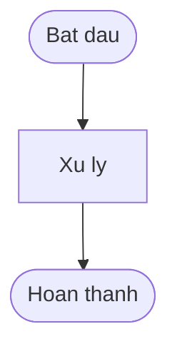
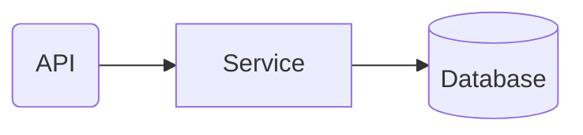

# Bao cao quan ly

> Milestone: {{milestone_name}} ({{version}})
> Ngay: {{date}}

## 1. Tom tat dieu hanh

<!-- AI fill: 3-5 bullet points tong quan milestone -->
<!-- Noi dung: Muc tieu milestone, ket qua dat duoc, thoi gian thuc hien -->

## 2. Tong quan Milestone

<!-- AI fill: bang tien do phases, so lieu thong ke -->
<!-- Format: bang Markdown voi cot Phase | Trang thai | Plans | Thoi gian -->

| Phase | Trang thai | Plans | Thoi gian |
|-------|-----------|-------|-----------|
| {{phase_name}} | {{status}} | {{plan_count}} | {{duration}} |

## 3. Luong nghiep vu (Business Logic Flow)

<!-- AI fill: Mermaid flowchart TD tu Truths va Key Links cua milestone -->
<!-- Moi Truth la mot node, lien ket theo dependency -->
<!-- Tuan thu mermaid-rules.md: quoted labels, max 15 nodes, Corporate Blue palette -->

## 4. Kien truc tong quan (Architecture Overview)

<!-- AI fill: Mermaid flowchart LR voi subgraphs tu Artifacts va CODE_REPORTs -->
<!-- Module boundaries ro rang, shapes theo Shape-by-Role (mermaid-rules.md) -->

## 5. Thanh tuu noi bat

<!-- AI fill: danh sach features, fixes, improvements quan trong nhat -->
<!-- Format: bullet list voi mo ta ngan gon tac dong kinh doanh -->

## 6. Chi so chat luong

<!-- AI fill: so lieu test coverage, so luong tests, code quality metrics -->
<!-- Format: bang hoac bullet list voi so lieu cu the -->

| Chi so | Gia tri |
|--------|---------|
| {{metric_name}} | {{metric_value}} |

## 7. Buoc tiep theo

<!-- AI fill: ke hoach milestone tiep theo, rui ro can theo doi -->
<!-- Format: bullet list voi timeline du kien -->
