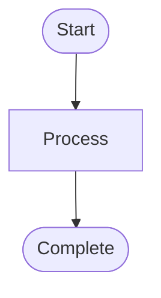
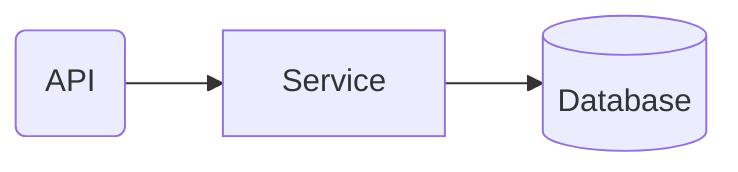

# Management Report

> Milestone: {{milestone_name}} ({{version}})
> Date: {{date}}

## 1. Executive Summary

<!-- AI fill: 3-5 bullet points for milestone overview -->
<!-- Content: Milestone goals, results achieved, execution timeline -->

## 2. Milestone Overview

<!-- AI fill: phase progress table, statistics -->
<!-- Format: Markdown table with columns Phase | Status | Plans | Duration -->

| Phase | Status | Plans | Duration |
|-------|--------|-------|----------|
| {{phase_name}} | {{status}} | {{plan_count}} | {{duration}} |

## 3. Business Logic Flow

<!-- AI fill: Mermaid flowchart TD from Truths and Key Links of the milestone -->
<!-- Each Truth is a node, linked by dependency -->
<!-- Follow mermaid-rules.md: quoted labels, max 15 nodes, Corporate Blue palette -->

## 4. Architecture Overview

<!-- AI fill: Mermaid flowchart LR with subgraphs from Artifacts and CODE_REPORTs -->
<!-- Clear module boundaries, shapes per Shape-by-Role (mermaid-rules.md) -->

## 5. Key Achievements

<!-- AI fill: list of important features, fixes, improvements -->
<!-- Format: bullet list with brief business impact description -->

## 6. Quality Metrics

<!-- AI fill: test coverage, test count, code quality metrics -->
<!-- Format: table or bullet list with specific numbers -->

| Metric | Value |
|--------|-------|
| {{metric_name}} | {{metric_value}} |

## 7. Next Steps

<!-- AI fill: next milestone plan, risks to monitor -->
<!-- Format: bullet list with projected timeline -->
